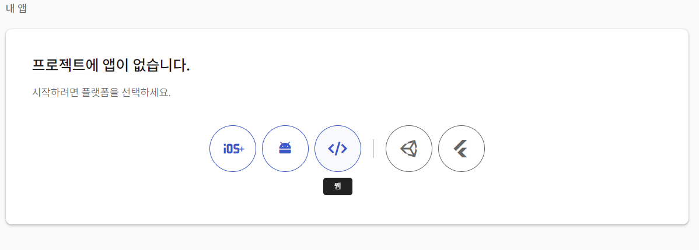
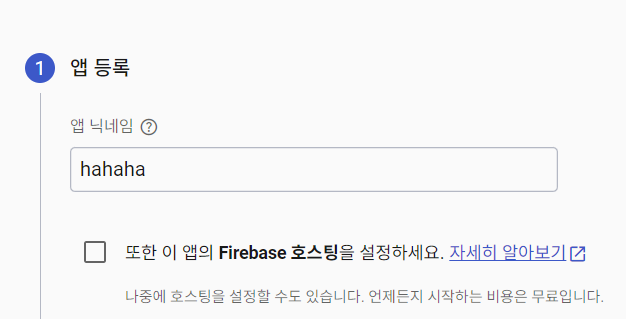
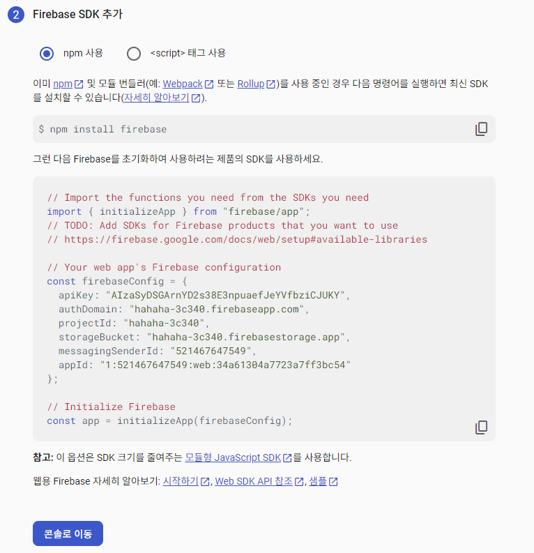
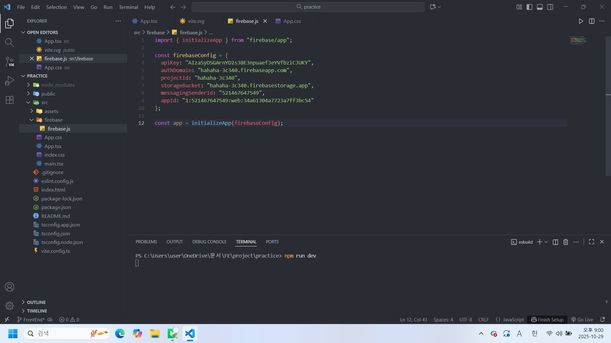

# 3.리액트와 연결하기

## 1.Firebase 프로젝트 생성하기

- Firebase Console 접속
- “프로젝트 추가” 클릭
- “웹 앱” 등록 (`</>` 아이콘)

## 2.Firebase SDK 설정하기

```tsx
import { initializeApp } from "firebase/app";

const firebaseConfig = {
  apiKey: "YOUR_API_KEY", // API키
  authDomain: "YOUR_AUTH_DOMAIN", // Firebase Authentication에서 사용하는 도메인
  projectId: "YOUR_PROJECT_ID", // Firebase 프로젝트 고유 ID
  storageBucket: "YOUR_STORAGE_BUCKET", // Firebase Storage (파일 저장소) 경로
  messagingSenderId: "YOUR_MESSAGING_SENDER_ID", // Firebase Cloud Messaging용 ID
  appId: "YOUR_APP_ID" // 앱 고유 식별자
};

const app = initializeApp(firebaseConfig);
```

### firebaseConfig 실제 값 찾기

- 좌측 상단의 **⚙️ “프로젝트 설정” 클릭**



- 내 앱에 가서 웹 버튼( `</>` )을 클릭한다.



- 앱 등록 시 닉네임을 입력한다.



- sdk 코드를 복사하고 리액트 폴더의 src폴더 안에서 firebase폴더를 만든 뒤 sdk파일을 만든다.


