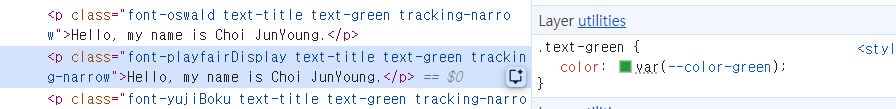

# 2.텍스트 꾸미기

## 폰트 크기 조정

```html
<p className="text-base">Hello world</p>
```

**text-값**

| **text-*** | **px** |
| --- | --- |
| `text-xs` | 12px |
| `text-s` | 14px |
| `text-base` | 16px |
| `text-lg` | 18px |
| `text-xl` | 20px |
| `text-2xl` | 24px |
| `text-3xl` | 30px |
| `text-4xl` | 36px |
| `text-5xl` | 48px |
| `text-6xl` | 60px |
| `text-7xl` | 72px |
| `text-8xl` | 96px |
| `text-9xl` | 128px |

## 폰트 두께 조정

```html
<p className="font-normal">Hello world</p>
```

**font-값**

| **font-*** | **font-weight** |
| --- | --- |
| `font-thin` | 100 |
| `font-light` | 300 |
| `font-normal` | 400 |
| `font-medium` | 500 |
| `font-semibold` | 600 |
| `font-bold` | 700 |
| `font-extrabold` | 800 |

## 글자 색

```html
<p class="text-black">검정</p>
<p class="text-gray-500">회색</p>
<p class="text-red-500">빨강</p>
<p class="text-indigo-600">인디고</p>
```

- `text-색 이름-진하기` 로 작성한다.
- 진하기는 100~900까지로 숫자가 커질수록 **진해진다.**

## 자간

```html
<p className="tracking-normal">Hello world</p>
```

**tracking-값**

| **tracking-*** | **설명** |
| --- | --- |
| `tracking-tight` | 좁게 |
| `tracking-normal` | 기본 |
| `tracking-wide` | 넓게 |

## 행간

```html
<p className="leading-normal">Lorem ipsum dolor sit amet, consectetur adipiscing elit, sed do eiusmod tempor incididunt ut labore et dolore magna aliqua. Ut enim ad minim veniam, quis nostrud exercitation ullamco laboris nisi ut aliquip ex ea commodo consequat. Duis aute irure dolor in reprehenderit in voluptate velit esse cillum dolore eu fugiat nulla pariatur. Excepteur sint occaecat cupidatat non proident, sunt in culpa qui officia deserunt mollit anim id est laborum.</p>
```

**leading-값**

| **leading-*** | **설명** |
| --- | --- |
| `leading-tight` | 빡빡 |
| `leading-normal` | 기본 |
| `leading-relaxed` | 여유 |

## 정렬

```html
<p className="text-left">Hello world</p>
```

**text-값**

| **leading-*** | **설명** |
| --- | --- |
| `text-left` | 왼쪽 정렬 |
| `text-center` | 가운데 정렬 |
| `text-right` | 오른쪽 정렬 |

## 기타 꾸밈 효과

```html
<p className="italic">이탤릭체</p>
<p className="underline">밑줄</p>
<p className="line-through">취소선</p>
<p className="no-underline">밑줄 제거</p>
```

## 폰트 바꾸기

### @theme를 이용한 폰트 변경

**`@theme`는 Tailwind에서 유틸리티로 변환되는 디자인 토큰을 CSS 안에서 정의하는 문법이다.**

```css
/* css파일 */
@import "tailwindcss";

@theme{
    --font-display:"Oswald", sans-serif;
}
```

- `@theme` 를 이용해서 유틸리티를 만들 때 `--카테고리-사용자 지정 이름` 으로 만든다.
- 이러면 `카테고리-사용자 지정 이름` 이란 유틸리티가 자동으로 만들어진다. (예:`font-display`)
- Tailwind에서 유틸리티란 **HTML에서 바로 쓰는 “기능 하나짜리 CSS 클래스**를 의미한다.

**tsx에서**

```html
<p className="font-display">
	Hello, my name is Choi JunYoung.
</p>
```

- 적용할 수 있는 속성에 `-유틸리티명` 을 붙이면 된다.
- `@theme` 에서 만든 유틸리티는 `font` 카테고리를 이용해 만들었기에 tsx에서 `font` 속성에만 사용할 수 있다.구글 폰트에서 폰트 갖다 쓰기

```css
@import url('https://fonts.googleapis.com/css2?family=Oswald:wght@200..700&display=swap');
@import "tailwindcss";

@theme{
    --font-display:"Oswald", sans-serif;
}
```

- 여기서 `@import url()` 이 `@import "tailwindcss";` 위에 있어야 한다.

## 속성 값 내 마음대로 지정하는 법

### 1. 대괄호

```html
<p
	className="
		text-[3rem]
		font-[900]
		text-[#00ffcc]
		tracking-[0.1rem]
		leading-[0.1rem]
	"
>
	Hello world
</p>
```

- 속성-[값]을 통해 스타일을 내 마음대로 지정할 수 있다.
- 이런 코드가 반복될 시엔 코드가 지저분해져 가독성이 떨어질 수 있다.

### 2. 반복되는 코드 @theme를 이용

***“이 값을 여러번 쓸거다**.”*

```css
@theme{
	--text-title:3rem; /*글자 크기*/
	--font-weight-strong:700; /*글자 굵기*/
	--font-oswald:"Oswald", sans-serif; /*글꼴*/
	--color-blue:oklch(0.52 0.29 261.59); /*글자 색상*/
	--tracking-title:0.5rem; /*자간*/
	--leading-title:0.5rem; /*행간*/
}
```

- 폰트를 바꿀 때 카테고리는 `font` , 글자 굵기를 바꿀 때 카테고리는 `font-weight` 이다.
- tailwind에서 색을 지정해줄 때 `oklch()` 로 색을 지정해줄 수 있다.
- `oklch()` 의 값은 개발자 툴에 들어가서 색이 적용된 태그를 클릭한 뒤 색을 지정할 수 있다.



**tsx에서**

```html
<p 
	className="
	  font-oswald
    font-strong
    text-title
    text-blue 
    tracking-title
    leading-title
  "
>
	Hello, my name is Choi JunYoung.
</p>
```

## 텍스트 꾸밀 때 @theme에서 쓸 수 있는 카테고리

| **카테고리** | **연결되는 유틸리티** |
| --- | --- |
| `--text` | `text-*` |
| `--font` | `font-*` |
| `--font-weight` | `font-*` |
| `--color` | `text-*` |
| `--tracking` | `tracking-*` |
| `--leading` | `leading-*` |
