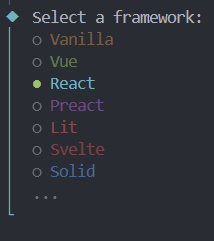
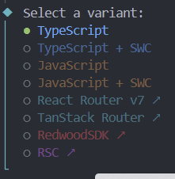

# 4.React와 같이 쓰기

React와 타입스크립트를 같이 쓰기 위해선 vite코드를 쓰는 것이 효율적이다.

## 1. 터미널로 vite코드를 생성한다.

```bash
npm create vite@latest
```

## 2.여러 프레임워크 중 react를 선택한다.



## 3.TypeScript를 선택한다



## 4.터미널에 npm install을 입력한다.

```bash
npm install
```

## 5. npm run dev로 실행할 수 있다.

```bash
npm run dev
```
