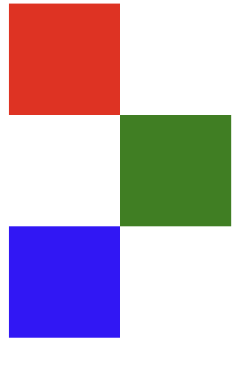
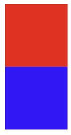
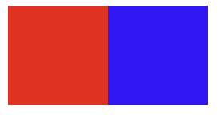

# 7.위치 속성

## position속성

```css
position:<속성값>;
```

- HTML 문서의 기본 흐름에서 벗어나 좌푯값에 따라 배치할 때 사용한다.

| 속성값 | 설명 |
| --- | --- |
| static | 요소를 기본 흐름에 따라 배치한다. |
| relative | 요소의 원래 위치를 기준으로 상대적으로(relative) 이동시킨다. |
| absolute | 가장 가까운 포지션이 지정된 부모(부모가 relative일 때) 요소 또는 브라우저를 기준으로 절대적인(absolute) 위치에 배치한다. |
| fixed | 절대적인 좌표 위치에 따라 배치하며 스크롤을 해도 위치가 고정되어 있다. |
| sticky | 기본 흐름에 따라 배치하지만, 지정한 좌표의 임계점에 이르면 fixed값처럼 화면에 고정된다. |

### 좌푯값

| 속성명 | 설명 |
| --- | --- |
| top | 위쪽을 기준으로 좌푯값을 지정한다. |
| right | 오른쪽을 기준으로 좌푯값을 지정한다. |
| bottom | 아래쪽을 기준으로 좌푯값을 지정한다. |
| left | 왼쪽을 기준으로 좌푯값을 지정한다. |

### 원래 배치


### 초록 박스의 position 속성 값을 relative로 설정하고 left값을 지정했을 때



### 초록 박스의 position 속성 값을 absoulte로 설정하고 left값을 지정했을 때


- relative 값일 때는 요소가 이동하더라도 다른 요소가 원래 위치에 있는 것처럼 유지되지만 absolute 값일 때는 요소를 움직이면 요소가 원래 있던 공간은 빈 공간으로 인식된다. 그래서 파란색 요소가 초록색 요소가 원래 있던 위치로 올라온다.
- position 속성값이 abolute 일 때 top이나 bottom 속성을 지정하지 않으면 left나 right 속성은 원래 위치에서 x축 방향으로만 움직인다.

## float속성

```css
float:<속성값>;
```

- 요소를 화면에 배치하는 또 다른 방법으로 float 속성이 있다.

| 속성값 | 설명 |
| --- | --- |
| left | 대상 요소를 공중에 띄워 왼쪽에 배치하면서 다음에 오는 요소를 주변에 자연스럽게 배치한다. |
| right | 대상 요소를 공중에 띄워 오른쪽에 배치하면서 다음에 오는 요소를 주변에 자연스럽게 배치한다. |

### 원래 배치



### 빨간 박스에만 float 속성 값을 left로 적용 시켰을 때


### 빨간 박스, 파란 박스 모두 float 속성 값을 left로 적용 시켰을 때



- float속성을 사용하면 요소를 공중에 띄워서 위치를 조정하기 때문에 빨간색 요소만을 float속성을 적용하면 파란색 요소가 문서의 흐름대로 밑으로 들어가면서 빨간색만 보이게 된다.

## tranform속성과 translate

```css
transform:translate(50%, -50%);
```

- 자기 요소의 크기를 기준으로 위치를 지정한다.

| 속성값 | 설명 |
| --- | --- |
| translateX() | 자기 너비를 기준으로 좌우 위치를 조정한다. |
| translateY() | 자기 높이를 기준으로 상하 위치를 조정한다. |
| translate(  ,  ) | 자기 크기를 기준으로 위치를 조정한다. |

## z-index

```css
z-index:10
```

- z-index란 요소가 여러개 있을 때 누가 위에 보이냐를 설정한다.
- z-index값이 클수록 요소가 위에 있다.
