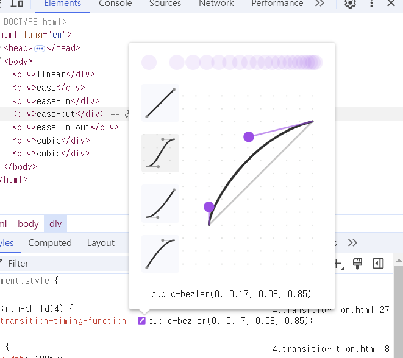

# 8.전환 효과

## transition-property 속성

```css
transition-property:<속성값>;
```

- 전환 효과를 적용할 대상 속성을 지정한다.

### 적용 방법

```css
/*커서가 닿기 전*/
div{
    background-color:red;
    transition-property:background-color;/*배경색을 바꿀 것이다라는 뜻*/
}
/*커서가 닿았을 때*/
div:hover{
    background-color:blue;/*배경색을 파랑색으로 바꿈*/
}
```

### 여러 속성 지정 가능

```css
transition-property:background-color, color, width...<속성>;
```

## transition-duration속성

```css
transition-duration:<시간>;
```

- 전환 효과의 지속 시간을 설정하는 데 사용한다.
- 속성 값으로는 초 단위 값(s, ms)값을 사용한다.

```css
transition-property:background-color, color, width;
transition-duration:1s, 500ms, 2s;
```

- transition-property속성과 transition-duration속성을 각각 지정할 수 있다.
- 위와 같이 코드를 작성한다면 배경 색(background-color)는 1초, 글자 색(color)은 0.5초, 너비(width)는 2초의 시간 동안 전환 하게 된다.

## transition-delay속성

```css
transition-delay:1s;
```

- 전환 효과의 발생을 지연할 수 있는 속성이다.
- 예제 코드처럼 transition-delay 속성 값을 1s라고 적으면 1초 뒤에 전환 효과가 나타난다.

## transition-timing-function속성

```css
transition-timing-function:<속성값>;
```

- 전환 효과의 진행 속도를 지정한다.

| 속성값 | 설명 |
| --- | --- |
| linear | 처음 속도와 마지막 속도가 일정하다. |
| ease | 처음에는 속도가 점점 빨라지다가 중간부터 점점 느려진다. |
| ease-in | 처음에는 속도가 느리지만 완료될 때까지 점점 빨라진다. |
| ease-out | 처음에는 속도가 빠르지만 완료될 때까지 점점 느려진다. |
| ease-in-out | 처음에는 속도가 느리지만 점점 빨라지다가 다시 점점 느려진다. |
| cubic-bezier() | 사용자가 정의한 속도로 진행한다. |

## 크롬 개발자 도구에서 속도 조절하기



- 원하는 효과대로 곡선을 조정하고 나면 곡선 아래 cubic-bezier()값이 보이는데, 이 값을 복사해 css에서 cubic-bezier속성 값으로 넣으면 된다.

## transition 속성으로 한 번에 지정하기

```css
transition:<property>, <duration>, <timing-function>, <delay>;
```

- property, duration, timing-function, delay순으로 쓴다.
- 모든 전환 효과 속성을 한 번에 작성할 수 있다.
