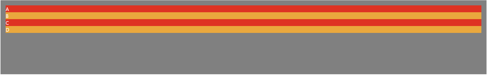
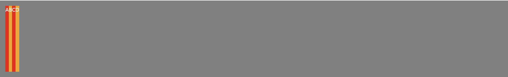
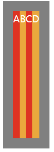

# 12.플렉스 박스 레이아웃 설계

## 플렉스 박스

- 1차원 방식으로 효과적으로 레이아웃을 설계할 수 있도록 고안된 스타일 속성이다.
- 여기서 1차원 방식이란 가로(row)나 세로(column) 중 한 방향으로만 레이아웃을 설계하는 방식을 말한다.
- 다양한 상황에서 유연하게 레이아웃을 구성할 수 있도록 다양한 속성들을 제공한다.

## 플렉스 박스 레이아웃 살펴보기


- 주축(main axis):플렉스 박스의 진행 방향과 수평한 축
- 교차축(cross axis):주축과 수직한 축을 말한다.
- 플렉스 컨테이너(flex container):display 속성값으로 flex나 inline-flex가 적용된 요소를 말한다.
- 플렉스 아이템(flex item):플렉스 컨테이너와 자식 관계를 이루는 태그 구성 요소를 말한다.

## display속성

```css
display:flex; /*inline-flex*/;
```

- 모든 플렉스 박스 레이아웃은 display 속성값을 flex나 inline-flex로 지정하는 것에서 시작한다.
- flex는 적용된 요소의 다음 요소가 항상 줄 바꿈 되고, inline-flex는 다음 요소가 주변에 배치되게 한다.

### display를 flex로 안 했을 때



### display를 flex로 했을 때



### display를 inline-flex로 했을 때



## flex-direction속성

```css
flex-direction:<속성값>;
```

- 플렉스 박스 레이아웃의 주축 방향을 결정한다.

| 속성값 | 설명 |
| --- | --- |
| row | 주축 방향을 왼쪽에서 오른쪽으로 지정한다. |
| row-reverse | 주축 방향을 오른쪽에서 왼쪽으로 지정한다. |
| column | 주축 방향을 위쪽에서 아래쪽으로 지정한다. |
| column-reverse | 주축 방향을 아래쪽에서 위쪽으로 지정한다. |

## flex-wrap속성

```css
flex-wrap:<속성값>;
```

- 플렉스 아이템이 플렉스 컨테이너 영역을 벗어날 때 어떻게 처리할지를 결정한다.

| 속성값 | 설명 |
| --- | --- |
| nowrap | 플렉스 아이템이 플렉스 컨테이너를 벗어나도 무시한다. |
| wrap | 플렉스 아이템이 플렉스 컨테이너를 벗어나면 줄 바꿈한다. |
| wrap-reverse | 플렉스 아이템이 플렉스 컨테이너를 벗어나면 wrap의 역방향으로 바꿔준다. |

## justify-content속성

```css
justify-content:<속성값>;
```

- 플렉스 아이템을 주축 방향으로 정렬할 때 사용하는 속성이다.

| 속성값 | 설명 |
| --- | --- |
| flex-start | 주축 방향을 시작을 기준으로 정렬한다. |
| flex-end | 주축 방향의 끝을 기준으로 정렬한다. |
| center | 주축 방향의 중앙에 정렬한다. |
| space-between | 플렉스 아이템 사이의 간격이 균일하도록 정렬한다. |
| space-around | 플렉스 아이템의 둘레(around)가 균일하도록 정렬한다. |
| space-evenly | 플렉스 아이템의 사이와 양끝의 간격이 균일하도록 정렬한다. |

## align-items, align-content, align-self속성

```css
align-items:<속성값>;
align-content:<속성값>;
align-self:<속성값>;
```

- 플렉스 아이템을 교차축 방향으로 정렬할 때 사용한다.

| 속성값 | 설명 |
| --- | --- |
| stretch | 교차축 방향으로 플렉스 아이템의 너비나 높이가 늘어난다. |
| flex-start | 교차축 방향의 시작을 기준으로 정렬한다. |
| flex-end | 교차축 방향의 끝을 기준으로 정렬한다. |
| center | 교차축 방향의 중앙을 기준으로 정렬한다. |
| baseline | 플렉스 아이템의 baseline을 기준으로 정렬한다. |

### align-content

플렉스 아이템을 교차축 방향으로 정렬할 때 사용하지만 align-items 속성과 다르게 플렉스 아이템이 flex-wrap 속성 때문에 두 줄 이상이 됐을 때만 사용한다.

### align-self

align-items 속성으로 플렉스 아이템을 한 번에 정렬하지 않고 각각 정렬하고 싶을 때 쓴다.

## flex값

```css
flex:n;
```

- 주축, 교차축을 차지하는 영역을 설정한다.
